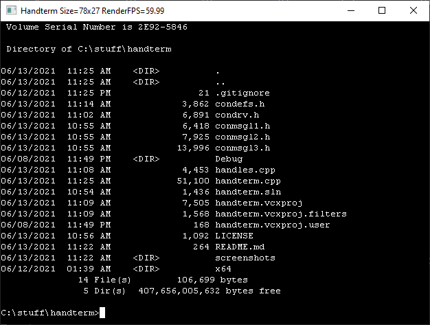
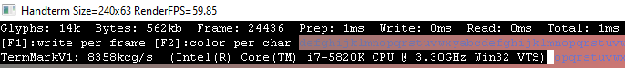
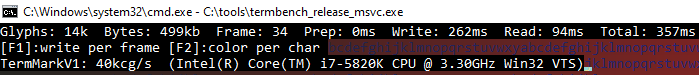

# Handterm

This project is an attempt to rewrite from scratch Windows conhost.exe. 
Main goal is to have better performance and reduce number of layers (in both source and threads/processes).

** THIS PROJECT IS IN EARLY DEVELOPMENT AND SHOULD NOT BE USED **

## Performance
[Termbench](https://github.com/cmuratori/termbench) results:

Versus conhost.exe

